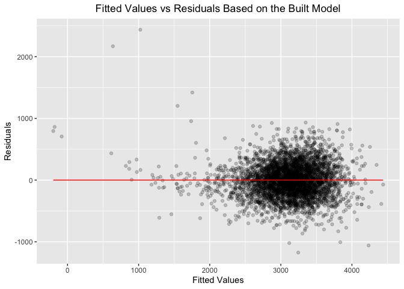

8105 HW6
================
2022-12-3

``` r
# load libraries
library(tidyverse)
```

    ## ── Attaching packages ─────────────────────────────────────── tidyverse 1.3.2 ──
    ## ✔ ggplot2 3.4.0      ✔ purrr   0.3.5 
    ## ✔ tibble  3.1.8      ✔ dplyr   1.0.10
    ## ✔ tidyr   1.2.1      ✔ stringr 1.4.1 
    ## ✔ readr   2.1.3      ✔ forcats 0.5.2 
    ## ── Conflicts ────────────────────────────────────────── tidyverse_conflicts() ──
    ## ✖ dplyr::filter() masks stats::filter()
    ## ✖ dplyr::lag()    masks stats::lag()

``` r
library(rvest)
```

    ## 
    ## 载入程辑包：'rvest'
    ## 
    ## The following object is masked from 'package:readr':
    ## 
    ##     guess_encoding

``` r
library(httr)
library(purrr)
library(patchwork)
library(viridis)
```

    ## 载入需要的程辑包：viridisLite

``` r
library(modelr)
library(mgcv)
```

    ## 载入需要的程辑包：nlme
    ## 
    ## 载入程辑包：'nlme'
    ## 
    ## The following object is masked from 'package:dplyr':
    ## 
    ##     collapse
    ## 
    ## This is mgcv 1.8-41. For overview type 'help("mgcv-package")'.

# Problem 2

``` r
# import the data 
url = "https://raw.githubusercontent.com/washingtonpost/data-homicides/master/homicide-data.csv"
homicide_df = read_csv(url) %>% 
  janitor::clean_names()
```

    ## Rows: 52179 Columns: 12
    ## ── Column specification ────────────────────────────────────────────────────────
    ## Delimiter: ","
    ## chr (9): uid, victim_last, victim_first, victim_race, victim_age, victim_sex...
    ## dbl (3): reported_date, lat, lon
    ## 
    ## ℹ Use `spec()` to retrieve the full column specification for this data.
    ## ℹ Specify the column types or set `show_col_types = FALSE` to quiet this message.

``` r
# tidy it according to the requirements
# resolved = 1, unresolved = 0
homicide_df = 
  homicide_df %>% 
  mutate(
    city_state = paste(city, state, sep = ","),
    disposition = ifelse(disposition == "Closed by arrest", 1, 0),
    victim_age = as.numeric(victim_age),
    victim_race = fct(victim_race)
  ) %>% 
  filter(city_state != "Dallas,TX" & city_state != "Phoenix,AZ" & city_state != "Kansas City,MO" & city_state != "Tulsa,AL") %>% 
  filter(victim_race == "White" | victim_race == "Black")
```

    ## Warning in mask$eval_all_mutate(quo): 强制改变过程中产生了NA

``` r
homicide_summary_df = 
  homicide_df %>% 
  group_by(city_state) %>% 
  select(city_state, disposition, victim_age, victim_sex, victim_race)
```

``` r
# Baltimore,MD
Baltimore_df = 
  homicide_summary_df %>% 
  filter(city_state == "Baltimore,MD") 
  
 
test_Baltimore = 
  glm(disposition ~ victim_age + victim_sex + victim_race, data = Baltimore_df, family = binomial()) %>%
  broom::tidy() %>% 
  mutate(
    OR = exp(estimate),
    CI_lower_bound = exp(estimate - 1.96 * std.error),
    CI_upper_bound = exp(estimate + 1.96 * std.error)
  ) %>% 
  select(term, estimate, OR, CI_lower_bound, CI_upper_bound) %>% 
  knitr::kable(digits = 4)
test_Baltimore
```

| term             | estimate |     OR | CI_lower_bound | CI_upper_bound |
|:-----------------|---------:|-------:|---------------:|---------------:|
| (Intercept)      |   1.1517 | 3.1637 |         1.9892 |         5.0315 |
| victim_age       |  -0.0067 | 0.9933 |         0.9868 |         0.9998 |
| victim_sexMale   |  -0.8545 | 0.4255 |         0.3246 |         0.5579 |
| victim_raceBlack |  -0.8418 | 0.4310 |         0.3060 |         0.6069 |

``` r
# all other cities' data
cities_stats = 
  homicide_summary_df %>% 
  nest(reg_data = -city_state) %>% 
  mutate(
    reg_line = map(.x = reg_data, ~glm(disposition ~ victim_age + victim_sex + victim_race, data = .x, family = binomial())),
    reg_line = map(reg_line, broom::tidy)
  ) %>% 
  select(-reg_data) %>% 
  unnest(reg_line) %>% 
  filter(term == "victim_sexMale") %>% 
  mutate(
    OR = exp(estimate),
    CI_lower_bound = exp(estimate - 1.96 * std.error),
    CI_upper_bound = exp(estimate + 1.96 * std.error)
  ) %>% 
  select(city_state, OR, CI_lower_bound, CI_upper_bound)

# making a plot
OR_plot =
  cities_stats %>% 
  ggplot(aes(x = fct_reorder(city_state, OR), y = OR)) + geom_point() + geom_errorbar(aes(ymin = CI_lower_bound, ymax = CI_upper_bound)) +
  labs(title = "OR for solving homicides comparing male to female", x = "City/State", y = "OR") +
  theme(axis.text.x = element_text(angle = 90, vjust = 0.9, hjust = 1)) +
  theme(plot.title = element_text(hjust = 0.5)) 

OR_plot
```

<!-- -->
comment of the OR plot: New York has the lowest estimated OR and
Albuquerque has the highest estimated OR and it also has the widest
confidence interval. Some cities like San Bemardino has lower OR than
some other cities but it has wider associated confidence interval.

# Problem 3

``` r
# data manipulation, check for any missing values
birth_df =
  read_csv("birthweight.csv") %>% 
  janitor::clean_names() %>% 
  select(bwt, everything()) %>% 
  drop_na()
```

    ## Rows: 4342 Columns: 20
    ## ── Column specification ────────────────────────────────────────────────────────
    ## Delimiter: ","
    ## dbl (20): babysex, bhead, blength, bwt, delwt, fincome, frace, gaweeks, malf...
    ## 
    ## ℹ Use `spec()` to retrieve the full column specification for this data.
    ## ℹ Specify the column types or set `show_col_types = FALSE` to quiet this message.

comment: The size of the birthweight dataset doesn’t change before and
after dropping the NAs, so there is no missing value in the dataset.

``` r
# convert numeric to factor where appropriate
birth_df %>% 
  mutate(
    babysex = as.factor(babysex),
    frace = as.factor(frace),
    malform = as.factor(malform),
    mrace = as.factor(mrace),
    parity = as.factor(parity),
    pnumlbw = as.factor(pnumlbw),
    pnumsga = as.factor(pnumsga)
  )
```

    ## # A tibble: 4,342 × 20
    ##      bwt babysex bhead blength delwt fincome frace gaweeks malform menarche
    ##    <dbl> <fct>   <dbl>   <dbl> <dbl>   <dbl> <fct>   <dbl> <fct>      <dbl>
    ##  1  3629 2          34      51   177      35 1        39.9 0             13
    ##  2  3062 1          34      48   156      65 2        25.9 0             14
    ##  3  3345 2          36      50   148      85 1        39.9 0             12
    ##  4  3062 1          34      52   157      55 1        40   0             14
    ##  5  3374 2          34      52   156       5 1        41.6 0             13
    ##  6  3374 1          33      52   129      55 1        40.7 0             12
    ##  7  2523 2          33      46   126      96 2        40.3 0             14
    ##  8  2778 2          33      49   140       5 1        37.4 0             12
    ##  9  3515 1          36      52   146      85 1        40.3 0             11
    ## 10  3459 1          33      50   169      75 2        40.7 0             12
    ## # … with 4,332 more rows, and 10 more variables: mheight <dbl>, momage <dbl>,
    ## #   mrace <fct>, parity <fct>, pnumlbw <fct>, pnumsga <fct>, ppbmi <dbl>,
    ## #   ppwt <dbl>, smoken <dbl>, wtgain <dbl>

``` r
# model building
# 1st step: put all variables into the model to check the possible coefficients
model_check = 
  lm(bwt ~ ., data = birth_df) %>% 
  broom::tidy()

model_check
```

    ## # A tibble: 20 × 5
    ##    term         estimate std.error statistic    p.value
    ##    <chr>           <dbl>     <dbl>     <dbl>      <dbl>
    ##  1 (Intercept) -6202.      668.      -9.28    2.60e- 20
    ##  2 babysex        32.3       8.55     3.78    1.57e-  4
    ##  3 bhead         134.        3.47    38.7     5.14e-282
    ##  4 blength        76.4       2.04    37.5     2.39e-266
    ##  5 delwt           3.96      0.399    9.92    5.90e- 23
    ##  6 fincome         0.654     0.178    3.68    2.32e-  4
    ##  7 frace          -5.87      8.80    -0.667   5.05e-  1
    ##  8 gaweeks        12.0       1.48     8.13    5.59e- 16
    ##  9 malform        14.2      71.4      0.199   8.42e-  1
    ## 10 menarche       -4.26      2.92    -1.46    1.45e-  1
    ## 11 mheight         4.75     10.4      0.457   6.48e-  1
    ## 12 momage          3.44      1.19     2.89    3.93e-  3
    ## 13 mrace         -48.2       9.96    -4.84    1.34e-  6
    ## 14 parity         89.9      40.9      2.20    2.81e-  2
    ## 15 pnumlbw        NA        NA       NA      NA        
    ## 16 pnumsga        NA        NA       NA      NA        
    ## 17 ppbmi          -0.968    15.0     -0.0644  9.49e-  1
    ## 18 ppwt           -2.66      2.64    -1.01    3.13e-  1
    ## 19 smoken         -3.72      0.582   -6.40    1.76e- 10
    ## 20 wtgain         NA        NA       NA      NA

comment: variables “pnumlbw”, “pnumsga”, “wtgain” have no estimate, so
we rule them out from the original model and build another model without
them.

``` r
# find the "best" model 
model_check_update =
  lm(bwt ~ babysex + bhead + blength + delwt + fincome + frace + gaweeks + malform + menarche + mheight + momage + mrace + parity + ppbmi + ppwt + smoken, data = birth_df)

model_check_update %>% 
  broom::tidy()
```

    ## # A tibble: 17 × 5
    ##    term         estimate std.error statistic   p.value
    ##    <chr>           <dbl>     <dbl>     <dbl>     <dbl>
    ##  1 (Intercept) -6202.      668.      -9.28   2.60e- 20
    ##  2 babysex        32.3       8.55     3.78   1.57e-  4
    ##  3 bhead         134.        3.47    38.7    5.14e-282
    ##  4 blength        76.4       2.04    37.5    2.39e-266
    ##  5 delwt           3.96      0.399    9.92   5.90e- 23
    ##  6 fincome         0.654     0.178    3.68   2.32e-  4
    ##  7 frace          -5.87      8.80    -0.667  5.05e-  1
    ##  8 gaweeks        12.0       1.48     8.13   5.59e- 16
    ##  9 malform        14.2      71.4      0.199  8.42e-  1
    ## 10 menarche       -4.26      2.92    -1.46   1.45e-  1
    ## 11 mheight         4.75     10.4      0.457  6.48e-  1
    ## 12 momage          3.44      1.19     2.89   3.93e-  3
    ## 13 mrace         -48.2       9.96    -4.84   1.34e-  6
    ## 14 parity         89.9      40.9      2.20   2.81e-  2
    ## 15 ppbmi          -0.968    15.0     -0.0644 9.49e-  1
    ## 16 ppwt           -2.66      2.64    -1.01   3.13e-  1
    ## 17 smoken         -3.72      0.582   -6.40   1.76e- 10

``` r
# add predictions and residuals to the model_check_update
birth_df %>% 
  add_residuals(model_check_update) %>% 
  add_predictions(model_check_update) %>% 
  ggplot(aes(x = pred, y = resid)) + 
  geom_point(alpha = 0.2) +
  geom_line(aes(y = 0), color = "red") +
  labs(
    title = "Fitted Values vs Residuals Based on the Built Model",
    x = "Fitted Values",
    y = "Residuals"
    ) +
  theme(plot.title = element_text(hjust = 0.5))
```

<!-- -->
comment: the residuals are basically symmetric around y=0, and centered
around the “y=0” line which makes sense.

``` r
# first comparison model
model1 = lm(bwt ~ blength + gaweeks, data = birth_df) %>% 
  broom::tidy()
model1
```

    ## # A tibble: 3 × 5
    ##   term        estimate std.error statistic  p.value
    ##   <chr>          <dbl>     <dbl>     <dbl>    <dbl>
    ## 1 (Intercept)  -4348.      98.0      -44.4 0       
    ## 2 blength        129.       1.99      64.6 0       
    ## 3 gaweeks         27.0      1.72      15.7 2.36e-54

``` r
# second comparison model
model2 = lm(bwt ~ bhead + blength + babysex + bhead * blength + bhead * babysex + blength * babysex + bhead * blength * babysex, data = birth_df) %>% 
  broom::tidy()
model2
```

    ## # A tibble: 8 × 5
    ##   term                   estimate std.error statistic     p.value
    ##   <chr>                     <dbl>     <dbl>     <dbl>       <dbl>
    ## 1 (Intercept)           -13552.     2759.       -4.91 0.000000939
    ## 2 bhead                    380.       83.4       4.56 0.00000528 
    ## 3 blength                  226.       57.4       3.94 0.0000843  
    ## 4 babysex                 6375.     1678.        3.80 0.000147   
    ## 5 bhead:blength             -4.43      1.72     -2.58 0.00981    
    ## 6 bhead:babysex           -198.       51.1      -3.88 0.000105   
    ## 7 blength:babysex         -124.       35.1      -3.52 0.000429   
    ## 8 bhead:blength:babysex      3.88      1.06      3.67 0.000245

``` r
# comparison models
compare_models = 
  crossv_mc(birth_df,100) %>% 
  mutate(
    train = map(train,as_tibble),
    test = map(test, as_tibble)
  ) %>% 
  mutate(
    model1_train = map(train, ~lm(bwt ~ blength + gaweeks, data = birth_df)),
    model2_train = map(train, ~lm(bwt ~ bhead + blength + babysex + bhead * blength + bhead * babysex + blength * babysex + bhead * blength * babysex, data = birth_df)),
    model_check_update_train = map(train, ~lm(bwt ~ babysex + bhead + blength + delwt + fincome + frace + gaweeks + malform + menarche + mheight + momage + mrace + parity + ppbmi + ppwt + smoken, data = birth_df))
  ) %>% 
  mutate(
    rmse_model1 = map2_dbl(model1_train, test, ~rmse(model = .x, data = .y)),
    rmse_model2 = map2_dbl(model2_train,  test, ~rmse(model = .x, data = .y)),
    rmse_model_check_update = map2_dbl(model_check_update_train, test, ~rmse(model = .x, data = .y)),
  )
```

modeling process description:

``` r
# draw a violin plot to compare three models (some code from lecture)
compare_models %>% 
  select(starts_with("rmse")) %>% 
  pivot_longer(
    everything(),
    names_to = "model",
    values_to = "rmse",
    names_prefix = "rmse_"
  ) %>% 
  mutate(
    model = fct_inorder(model)
  ) %>% 
  ggplot(aes(x = model, y = rmse,color = model)) + 
  geom_violin()+
  labs(
    x = "Three Different Models",
    y = "rmse",
    title = "Comparison of Three Models"
  )+
  theme(plot.title = element_text(hjust = .5))
```

<!-- -->
comment:
